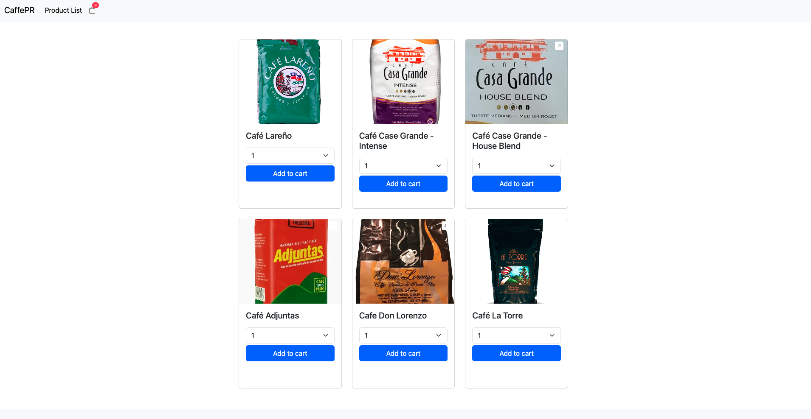
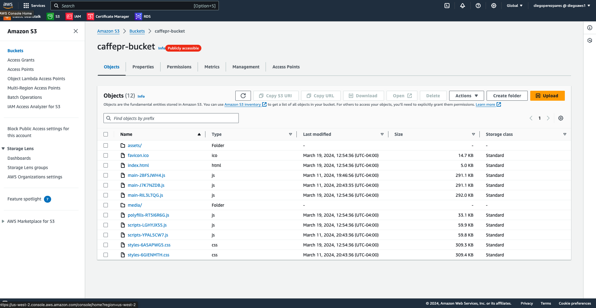

# CaffePR repo for CircleCI

This repo is for CI/CD, enabled through CircleCI. Here you can find the frontend and backend of the CaffePR app. Below there is a brief overview of the app and a bit of information about hosting. To find more details about either the backend or frontend, please navigate to the corresponding folder's README so you can read more about the dependencies, setup, API endpoints, and any other info.

## Overview

CaffePR is a simple shop where you can buy grinded coffee from different Puerto Rican brands. Currently it's still in development, and functionality to persist your shopping cart or complete a purchase is not yet available, though you can access the the app through the link below. The app is running fully on AWS services: the frontend is hosted an S3 bucket, the backend/API on a single instance with Elastic Beanstalk, and the Postgres database on RDS.

[Access app here](http://caffepr-bucket.s3-website.us-east-2.amazonaws.com/)

Screenshot of home page:

Screenshot of the frontend:

Screenshot of the backend:

Screenshot of the frontend:

You can view diagrams and documentation about the insfractructure and pipeline [here](./docs/).