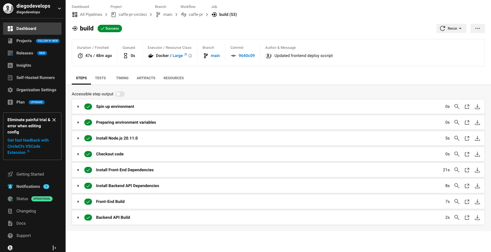

# Pipeline description

We're using CircleCI for our CI/CD pipeline, which is connected to this public Github repo [here](https://github.com/diegodevelops/caffe-pr-circleci/tree/main), and the workflow is triggered automatically everytime we push new code to the 'main' branch.

The workflow is divided into two 'jobs':

1. **build**
2. **deploy** 

*Since the app is still in development, we are ommiting a 'hold' filter, and so deployment is being done automatically right after the **build** job.

## Build 

As you can see in the screenshot below, the **build** job involves eight (8) steps:

1. Spin up environment
2. Preparing environment variables
3. Install Node.js
4. Checkout code
5. Install frontend dependencies ie. `npm install`
6. Install backend dependencies ie. `npm install`
7. Frontend build
8. Backend build

You can navigate to the circleci config file to see the jobs and steps in `/.circleci/config.yaml`.
